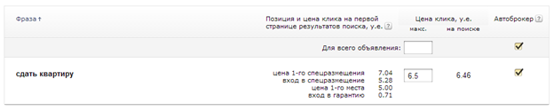
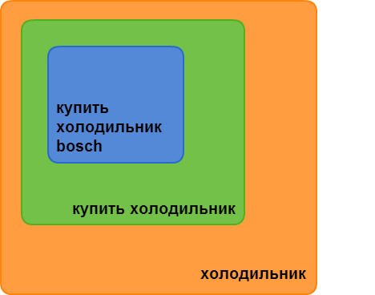
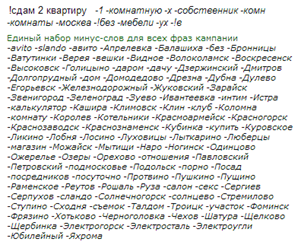

# Каверзный контекст в “перегретой” нише:
### Какой путь оптимальнее?

###### Автор: Антон Данилов, Head of SEM, Интернет-гипермаркет HomeMe.ru
###### [Обсуждение](http://on.fb.me/1raBWrn) / [презентация](http://slidesha.re/1raBZnh)

### Введение

На рынках, где применима контекстная реклама, есть ниши, в которых рекламодателей в разы больше, чем мест под рекламу в поисковой выдаче. Единственный способ занять «место под солнцем» в этом случае – завышать ставки по своим рекламным объявлениям, что приводит к так называемым «перегретым» нишам. Как правило, это можно наблюдать в нишах с бедной семантикой, когда, по сути, все конверсии приходятся на одно ключевое слово. В качестве примера укажем риелторскую нишу по сдаче квартир в аренду. Цену за клик, предлагаемую системой Яндекс.Директ для такого ключевого слова, можно увидеть на рис. 1.

Рисунок 1. Цена клика в системе Яндекс.Директ по ключевому слову «сдать квартиру»

### Основные понятия и формулы
Вам нужно повысить эффективность контекстной рекламы, но как? Чтобы более точно понимать составляющие эффективности, начнем с классических определений и метрик в контекстной рекламе.

**Оборот** (онo же Gross Revenue или же просто Revenue) – это доход, который получает компания от своей деятельности: продаж товаров, оказания услуг и т.п.

**Средний чек **(оно же average order value, AOV) – это сумма, которую тратит среднестатистический покупатель, приобретая товар или заказывая услугу.

Теперь свяжем эти два параметра формулой:

 (1)

где n – количество покупок, заказов и т.п.

Перепишем формулы, раскрыв n через коэффициент конверсии.

 (2)

где CR – коэффициент конверсии (отношение общего числа покупок к общему числу кликов), Cliks – общее количество кликов по рекламным объявлениям.

В свою очередь, клики мы можем расписать через показы рекламы и CTR.

 (3),

где Im – общее количество показов рекламных объявлений, CTR – это отношение общего числа кликов к общему числу показов рекламного объявления.

Если из оборота мы вычтем наши затраты на рекламу, то получим прибыль (Profit) без учета маржинальности товара или услуги.

 (4)

где Cost – расходы на рекламу.

Теперь распишем расходы на рекламу через сумму кликов и стоимость одного клика.

 (5),

где cpc – средняя стоимость одного клика по рекламному объявлению.

Подставляя в (5) приведенное ранее выражение (3), мы получим следующую формулу прибыли:

 (6)*

Из формулы (6) понятно, что для повышения эффективности контекстной рекламы нужно:

* наращивать объем релевантных** показов;

* величивать показатель CTR;

* поднимать средний чек;

* увеличивать коэффициент конверсии;

* снижать цену клика рекламного объявления.

\* Приведенную формулу нельзя воспринимать чересчур буквально, т.е. если стоимость клика для конкретного объявления удается снизить за счет перемещения на более дешевую рекламную позицию (например, из спецразмещения в гарантированные показы), это приведет к падению его показателя CTR. Между величинами в приведенной формуле (6) есть более сложные зависимости. Мы же подразумеваем, что рассматриваем ситуацию изменения одного из показателей формулы (6) при фиксированных значениях остальных.

\*\* Под количеством показом мы подразумеваем только релевантные показы. Конечно, можно увеличить долю показов рекламных материалов за счет нерелевантных регионов или нерелевантных ключевых слов, но в таком случае объем именно релевантных показов расти не будет.

</td></tr><tr><td>
</td><td>Далее в статье мы подробно разберемся, как улучшить приведенные в формуле (6) показатели (за исключением среднего чека: как правило, такая задача решается вне рамок контекстной рекламы).

### Семантическое ядро. Понятие «ключевое слово»
Каждый, кто знаком с контекстной рекламой, знает, что создание рекламной кампании начинается с подбора ключевых слов. От того, насколько грамотно сформировано ядро ключевых слов, в значительной степени зависит результат рекламной кампании.

Каждую рекламную нишу можно охарактеризовать несколькими словами, которые будут входить в каждое из ключевых слов. Назовем такие популярные слова **однословниками**. Примерами в мебельной тематике могут быть «мебель», «диван», «стол», «кресло», «шкаф». В бытовой технике — «холодильник», «мультиварка», «кондиционер», «хлебопечка» и т.д. В некоторых нишах бывает сложно выделить однословники, и поэтому их характеризуют фразами-**двухсловниками**. В рассматриваемой нише это, например, «сдать квартиру».

Посмотреть частоту показов для каждой фразы можно с помощью сервиса[ http://wordstat.yandex.ru.](http://wordstat.yandex.ru./) Частота показов для однословника обозначает число показов всех возможных вариантов фраз с этим словом, в том числе двусловников, трехсловников и т.д. Схематично такая частота показов на примере слова «холодильник» отображена на рис. 2.

Рисунок 2. Схема вложенности частоты показов фраз, где каждая область характеризует частоту показов

Из этого следует очень простой вывод, что

WS[однословника] ≥ WS[двухсловника] ≥ WS[трехсловника] и т.д.,

где WS[] – обозначение частоты показов фразы.

Из всего вышесказанного следует, что поисковая фраза может быть более низкого порядка вложенности, нежели ключевое слово, которое мы задаем в системе контекстной рекламы: для ключевого слова «холодильник» (приведенного без операторов соответствий) объявление может быть показано по фразам «купить холодильник», «купить холодильник bosch» и др.

</td></tr></tbody></table>

Так как Яндекс хранит статистику далеко не по всем поисковым запросам, а в системе контекстной рекламы он оперирует понятием «ключевое слово», то далее мы будем называть ключевым словом те фразы, которые задаем в аккаунт Яндекс.Директа или же Google Adwords.*

*Подробнее о различиях между ключевыми словами и поисковыми запросами можно прочитать в статьях[ Михаила Левина «Click-prediction в контекстной рекламе»](https://tech.yandex.ru/events/yac/m/talks/873/) и[ Чада Саммерхилла «Advanced Search Query Mining Part 1: The Power of Search Queries»](http://www.wordstream.com/blog/ws/2010/11/10/advanced-search-query-mining).

### Вероятность релевантного показа

Если частота показов каждого ключевого слова содержит частоты показов по поисковым фразам, то ее можно разложить на три составляющие:

1. частоту показов во фразовом соответствии;

2. частоту показов по релевантным запросам (коммерческим);

3. частоту показов по нерелевантным запросам (информационным).

 (7).

**Вероятностью релевантного показа** мы будем называть отношение частоты релевантных показов, вызванных ключевым словом, к общей частоте показов рекламы по ключевому слову.

 (8)

где α – вероятность релевантного показа для ключевого слова во фразовом соответствии.

Определим α по следующей формуле:

 (9)

Т.е. задавая ключевое слово «холодильник» во фразовом соответствии, мы не можем однозначно сказать, что хочет сделать пользователь — купить его или же почитать о нем справку.

Из формул (7) и (8) [А1] следует более общая формула для частоты релевантного показа:

 (10)

Согласно формуле (10) для того, чтобы максимизировать вероятность релевантного показа рекламного объявления, нужно максимально снизить долю так называемых информационных показов.*

* По идее, теперь формулу (6) можно модернизировать, добавив в нее вероятность релевантного показа. В этом случае под Im можно понимать объем всех показов рекламных объявлений. Тогда формула (6) примет вид:

 (11).

### Три подхода к использованию ключевых слов
При работе в «перегретых» нишах удалось выделить три подхода к использованию ключевых слов в системе контекстной рекламы. Рассмотрим их на примере системы Яндекс.Директ.

#### 1. Минус-слова для ВЧ-запросов

Суть подхода заключается в том, что для каждого ключевого слова добавляется список минус-слов (см. рис. 3).

Рисунок 3. Первый подход к использованию ключевых слов.

**Плюсы метода:** максимизируется объем показов (Im), что по формуле (6) безусловно хорошо. Относительно небольшое время тратится на создания рекламных кампаний.

**Минусы метода:** огромная доля нерелевантных показов (минимизируется r), т.к. место для минус-слов ограниченно 4096 позициями, так что отминусовать все информационные фразы зачастую не представляется возможным.

#### 2. «!кавычки»

Суть метода очень проста: ко всем релевантным ключевым словам добавляются операторы. В результате реклама показывается на поисковые запросы, очень близкие к ключевым словам.

**Плюсы метода:** максимальная вероятность релевантного показа объявления (максимизируется r). Быстрое создание рекламных кампаний.

**Минусы метода:** минимизируется объем показов (Im), что по формуле (6), безусловно, плохо.

#### 3. Смешанный или схема «дерева»

Суть метода заключается в том, что для однословников (корень), которые характеризуют нишу, подбираются двухсловники – высокочастотные ключевые слова, также называемые «масками» (ствол). Эти «маски» добавляются в систему во фразовом соответствии или же со всевозможными вариациями точного соответствия. От «масок» строятся ответвления в виде трехсловников, как правило, это среднечастотные ключевые слова (главные ветки от ствола)*, для которых подбирается огромный пул минус-слов, а затем четырехсловники, пятисловники и т.д. до 7-словников! Пример структуры «дерева» приведен на рис. 4.

Рисунок 4. Пример структуры “дерева”.

**Плюсы метода:** максимизируется объем показов (Im), что по формуле (6), безусловно, хорошо. Максимизируется вероятность релевантного показа объявления (r).

**Минусы метода:** огромное время тратится на создание рекламных кампаний.

*Бывают случаи, когда трехсловник может выступать в виде «маски». Тогда процедура повторяется, только на уровень ниже.

### Сбор семантики
Объем статьи не позволяет подробно рассмотреть каждый сервис по сбору семантики и каждый метод работы с ними, поэтому выделим только самые интересные.

#### 1. Парсинг

 [http://wordstat.yandex.ru](http://wordstat.yandex.ru/)

Как уже говорилось ранее, для каждой ниши есть свой набор однословников. Для того чтобы построить «деревья», нам нужны маски-двухсловники, содержащие однословники. В качестве примера рассмотрим однословник «диван» в мебельной нише. Если мы хотим взять все фразы из wordstat, содержащие его, то можем увидеть, что сервис выдает только первые 40 страниц фраз по 50 фраз на каждой странице, итого 2 тыс. фраз (пример[ тут](http://wordstat.yandex.ru/#!/?page=40&words=%D0%B4%D0%B8%D0%B2%D0%B0%D0%BD) ). Если же мы будем парсить однословник, зафиксировав морфологию (т.е. !диван, !диваны и т.д.), мы увидим, что сервис выдает уже по 2 тыс. фраз для каждого слова (пример[ тут](http://wordstat.yandex.ru/#!/?page=40&words=!%D0%B4%D0%B8%D0%B2%D0%B0%D0%BD) и[ тут](http://wordstat.yandex.ru/#!/?page=40&words=!%D0%B4%D0%B8%D0%B2%D0%B0%D0%BD%D1%8B), а полный файл фраз для слова “диван” можно скачать[ тут](http://goo.gl/TGSwrA)) . Таким образом мы наберем более чем 9 тыс. фраз. Далее мы убираем стоп-слова и вычленяем все двухсловники, а потом из этих двухсловников отбираем только подходящие «маски».

#### 2. Поисковые подсказки

Чтобы каждое ответвление от «ствола дерева» наполнить «веточками», нужно собрать недюжинную семантику, содержащую маски-двухсловники. Сделать это проще можно через подсказки Яндекса или Google, которые они генерят при вводе фразы в поисковую строку. Но то, какие это будут подсказки, зависит от буквы, с которой начинается следующее слово, и порядка слов во фразе (см. рис. 5 и 6).

Рисунок 5. Поисковые подсказки в Яндекс.

Рисунок 6. Поисковые подсказки в Яндекс.

Собрать их все можно через сервис[ key collector](http://www.key-collector.ru/), предварительно подготовив шаблон в Excel, как это показано на рис. 7.*

Рисунок 7. Создание в Excel шаблона для сбора семантики.

*В key collector появилась подобная опция, поэтому проверьте настройки парсинга подсказок, и шаблон можно будет не создавать.

#### 3. Искусственная семантика

Этот метод очень хорош для подбора низкочастотных фраз.

Часто можно встретить фразы, в которых одно слово можно сделать параметрическим и сформировать из него целый пул схожих ключевых слов. Например, если взять фразу «сдать квартиру метро вднх» и перебрать все станции московского метрополитена, можно получить 194 работающих низкочастотных запроса.  Это легко реализовать в Excel (см. рис. 8).

Рисунок 8. Создание искусственной семантики в excel.

### Биддинг

В e-commerce от пользователей, совершивших переход на сайт по контекстной рекламе, ожидается определенное действие (action), и, как правило, рекламодатель готов платить определенную цену за это действие CPA (cost per action). Действием может быть покупка, заказ, заявка и т.п. Если мы распишем CPA, то получим:

 (12),

где n – количество действий.

Перепишем формулу (12) в ином виде, раскрыв n:

 (13).

Отношение расходов к кликам есть ни что иное, как средняя стоимость клика. Тогда (13) можно записать как:

 (14).

Т.к. в системах контекстной рекламы действует аукцион второй цены, то значение ставки будет всегда больше или равно значению цены за клик для конкретного ключевого слова:

 (15)

для i-го ключевого слова.

Поэтому на начальном этапе логичным будет задать ставку из соображений формулы (14), только значение CPA взять максимальное допустимое, т.е.:

  (16)

Но т.к. на начальном этапе не ясны значения коэффициента конверсии для каждого конкретного ключевого слова, то значение CRi в формуле (16) будет общее для всех, соответственно, ставка так же будет одна общая.

По мере набора статистики значения bid можно детализировать на уровне каждого ключевого слова по следующей формуле:

 (17),

где hi – доля запаса для исторического значения cpc.

Параметр h обычно зафиксирован на уровне 10-30%. Есть способы автоматически рассчитать этот параметр основе исторических данных.

Если же ставку задавать на уровне ключевых слов по историческим данным, исходя из предположений формул (16) и (17), возникает проблема для коэффициента конверсии, связанная со статистикой для низкочастотных ключевых слов (см. рис. 9).

Рисунок 9. Проблема НЧ - ключевых слов.

Может возникнуть такая ситуация, когда два ключевых слова имеют статистику по 1 переходу, но один из них имеет конверсию, а второй нет. В такой ситуации по формуле (16) получится, что ставку одному из ключевых слов нужно задать равную CPAmax, а для другого – равную нулю. Решением же такой проблемы может стать байесовская оценка для значения коэффициента конверсии, т.е.:

 (18),

где ni – конверсии по i-му НЧ – ключевому слову, n– среднее значение конверсии по группе ключевых слов, рекламной кампании или же группе рекламных кампаний, Ki и K– соответствующие значения кликов.

Тогда общая формула примет вид:

 (19)

CPA, как правило, до уровня ключевых слов не детализируют, т.к. структура аккаунта подразумевает разбивку рекламных кампаний по маржинальности, среднему чеку или ДРР (доле рекламных расходов).

### Корректировки ставок

В разделе «Биддинг» мы рассмотрели способ задания ставки на уровне ключевых слов по историческим данным, но т.к. аукцион происходит при каждом показе и ставки меняются достаточно быстро, величина CPC волатильна (изменчива) в зависимости от времени суток и дня недели. Рассмотрим, как можно решить эту проблему простыми корректировками ставки.

Как гласит справка Google AdWords, «вы можете уменьшать и увеличивать ставки для показа рекламы в определенные дни недели, часы и другие интервалы времени», но почему-то никто не приводит примеров и не говорит, как это сделать. Что же можно предпринять?

Предположим, что bid ~ CPA × CR, где CPA – плата за действие (покупка, заказ и т.п.) и CPA = const. Коэффициент конверсии, напротив, волатильная величина, и поэтому, зная распределение коэффициента конверсии в зависимости от времени суток и дня недели, мы можем получить необходимые корректировки для bid.

* Строим в Google Analytics такой отчет, как показано на рис.9.

Рисунок 9. Пользовательский отчет в Google Analytic.

* Теперь мы можем получить отчеты по распределению коэффициентов конверсий (см. рис. 10 и 11).

Рисунок 10. Пример распределения коэффициента конверсии (CR) в зависимости от для недели

Рисунок 11. Пример распределения коэффициента конверсии (CR) в зависимости от времени суток

* Сводя эти отчеты в Excel, можно получить матрицу распределений для коэффициента конверсии (см. рис. 12).

Рисунок 12. Матрица распределений для коэффициента конверсий

* Осталось только нормировать распределение CR  относительно средневзвешенного значения для коэффициента конверсии, и можно загрузить корректировки в систему Google AdWords* (см. рис. 13).

Рисунок  13. Матрица  корректировок  ставок

*Чтобы повторить подобный трюк для системы Яндекс.Директ, надо произвести вторую нормировку относительно максимального значения, т.к. в Директе корректировки можно задавать только на понижение. В этом случае формула для bid также преобразится и будет bid~CPA*CRmax

### Заключение

В заключение вернемся к формуле (6), представленной в начале статьи. Рассмотренный метод работы с семантическим ядром, а также тонкие настройки биддинга и корректировки ставок позволят вам искать оптимальное решение для контекста в перегретой нише. Детально прорабатывая каждую переменную вы справитесь с самыми нестандартными задачами!

###### [Обсуждение](http://on.fb.me/1raBWrn) / [презентация](http://slidesha.re/1raBZnh)

