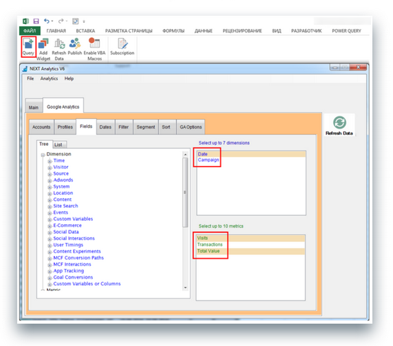

# Эффективный анализ статистики и полноценная ручная оптимизация кампаний в Яндекс Директе по CPA/ROI

###### Автор: Максим Лепихов, руководитель отдела контекстной рекламы CubeLine Agency.
###### [Обсуждение](http://on.fb.me/1raHrGv) / [презентация](http://slidesha.re/1raHrX9) / [видео](http://youtu.be/V9e195znLDM)

http://youtu.be/V9e195znLDM

### Вступление

Прежде чем анализировать и оптимизировать рекламные кампании в Яндекс Директ, нужно получить статистические данные, с которыми будем работать.

Я расскажу, как быстро получить детальную статистику по каждой рекламной кампании в обход API Яндекс Директа.

Продемонстрирую несколько кейсов на основе полученных данных:

1. Анализ рекламных блоков (спецразмещение и гарантия).

1. Поиск неэффективных площадок в РСЯ и их отключение.

1. Влияние изображений на эффективность рекламы. Оставляем только лучшие изображения.
Расскажу, как дополнить данные из Яндекс Директа еще и статистикой из Google Analytics, как экспортировать эти данные без ограничений и семплирования за любой период.
Продемонстрирую еще один кейс на основе полученных данных:

4. Анализ ROI и оптимизация ставок.

### Полуавтоматическая выгрузка статистики из Яндекс Директа в обход API

1. Нужно зайти в “Мастер отчетов” любой кампании и выбрать необходимые данные для выгрузки.

1. Скопировать ссылку на XSL-файл внизу страницы результатов. В ссылке нас интересуют только два значения: название файла (пример: 03.09-10.09_main8598616.xls) и ID кампании (GET параметр cid).

1. Теперь нам нужны ID всех кампаний, по которым требуется получить статистику. Удобнее всего их скопировать из Директ Коммандера.

1. С помощью Excel генерируем список ссылок для выгрузки, подставляя на место названия файла и ID в ссылке значения ID наших кампаний.

1. Выгружаем отчеты по этим ссылкам при помощи менеджера закачек. Важно, что менеджер закачек должен уметь поддерживать возможность авторизации на сайте (я использую дополнение Chrono для браузера Chrome).

1. В результате получаем множество xls-файлов. Имя каждого файла – это ID кампании.

1. Теперь все это нужно объединить в один файл Excel. Для этого я использую надстройку под названием PLEX ([http://www.planetaexcel.ru/plex/](http://www.planetaexcel.ru/plex/)). Первым шагом собираем все в один файл при помощи функции “Сборка листов”.

Содержимое каждого файла оказывается на отдельном листе. При помощи функции “Собрать” переносим все на один лист.

Данные есть, можем начинать анализировать. Для этих задач я использую сводные таблицы Excel.

#### Кейс 1. Анализ рекламных блоков

При помощи полученной статистики мы можем сравнить CTR разных блоков (спецразмещение и гарантия + динамика) по всем кампаниям. CTR стоит  смотреть отдельно по каждому блоку, так как они очень сильно различаются. Можно анализировать эти данные как на уровне кампаний, так и на уровне ключевых фраз.

Так мы сразу видим фразы с низким CTR и есть смысл обратить на них особое внимание. Возможно, стоит переписать объявления на более релевантные.

#### Кейс 2. Анализ площадок в РСЯ

Построив сводную таблицу по площадкам и рассчитав нужные значения, можно выделить неэффективные площадки, по которым достаточно много кликов, но плохая конверсия в действия и достаточно высокий CPA. Такие площадки имеет смысл сразу занести в список запрещенных и не рекламироваться на них в дальнейшем.

Хочу обратить внимание, что нет четкой зависимости между CTR и CPA. Бывают ситуации, когда CTR достаточно низок, но при этом CPA тоже имеет низкое значение, и наоборот. Поэтому не нужно ориентироваться только на CTR. Эффективнее анализировать поведение пользователей уже на вашем сайте.

#### Кейс 3. Анализ изображений

Строим сводную таблицу по 2 типам показов рекламных объявлений: с изображением и без изображения. Дополнил таблицу графиками, для лучшей визуализации.

Я думаю, все понимают, что объявления с изображениями работают эффективней. В данном кейсе я наглядно это сравнил. Добавление изображения существенно повышает CTR объявлений. В данном случае он увеличился почти в 3 раза. На 20% увеличился коэффициент конверсий и CPA снизился на 20%.

Обязательно добавляйте изображения к объявлениям на РСЯ!

Общую эффективность сравнили, эффективность использования изображений доказали, теперь проанализируем более детально самые популярные изображения.

Для этого снова используем сводные таблицы Excel, но уже по конкретным изображениям. Чтобы загрузить изображения в Excel, удобно использовать надстройку PastePictures [http://excelvba.ru/programmes/PastePictures](http://excelvba.ru/programmes/PastePictures)).

Сразу видим объявления с высоким CPA и можем отключить объявления с такими изображениями, чтобы заменять их более эффективными.

Применяя такой подход, можно очень удобно проводить сплит-тесты изображений, измерять их эффективность и оставлять только лучшие.

### Экспорт дополнительной статистики из Google Analytics

Бывают случаи, когда данных из Яндекс Директа недостаточно. Например, когда нам нужно рассчитать ROI/ROMI, нужно знать доход. Эти данные мы можем получить из Google Analytics. Но для этого важно не забывать размечать ссылки (проставлять UTM-метки) в рекламных кампаниях.

Для выгрузки статистики из Google Analytics предпочитаю использовать надстройку для Excel под названием NEXT Analytics ([http://www.nextanalytics.com/](http://www.nextanalytics.com/)). Данный инструмент не имеет ограничений на количество выгружаемых строк (например, выгрузить 200 тыс. строк для него не проблема), умеет обходить семплирование.

Процесс семплирования подразумевает анализ определенной выборки данных вместо всего объема для экономии аппаратных ресурсов серверов Google Analytics.

Когда Google семплирует данные?

* Если любой запрашиваемый отчет содержит более 1 000 000 уникальных параметров, например, реффералов или ключевых слов;

* Если запрашиваемый отчет подразумевает обработку более 500 000 сессий пользователей.

Процесс выгрузки данных средствами NEXT Analytics for Excel.

Полученные из Google Analytics данные объединяем с нашей статистикой из Яндекс Директ. Теперь можем рассчитать ROI.

#### Кейс 4. Анализ ROI и оптимизация ставок

Создаем сводную таблицу по кампаниям, рассчитываем различные параметры, такие как CPO, ROI, CR.

1. Из формулы расчета ROI можно вывести формулу для расчета оптимальной ставки (CPC) для требуемого ROI. Она имеет следующий вид: CPC = Доход / (ROI + 1) * Клики.

1. Для расчета ставки задаем необходимые данные, в данном случае это:
    * ROI – планируемое значение, которое нужно получить в результате оптимизации ставок.
    * Transactions – минимальное количество транзакций на кампанию для расчета отимального CPC. Если для кампании это значение меньше, то используем среднее значение по всем кампаниям.
    * MaxCPC – максимальная ставка CPC, которую мы готовы платить.
    * MinCPC – минимальная ставка CPC.
    * RateCPC – разница в процентах между CPC и финальной ставкой в Яндекс Директе. Дело в том, что при помощи формулы мы рассчитываем среднее значение CPC, а в Яндекс Директе должны указать максимальную ставку клика. Обычно эта разница составляет порядка 15-20%. В данном случае я жестко указываю эту разницу, но ее так же можно рассчитать и для каждой кампании на основе данных за предыдущий период.

3. После расчета оптимального CPC рассчитываем финальную ставку (FinalCPC). Результат её расчета вы можете увидеть в крайнем правом столбце в таблице на рисунке выше. Теперь наши расчетные ставки прогружаем в Яндекс Директ. Для этого мне удобнее всего использовать Коммандер.

### Заключение

**Ручная оптимизация – это круто!**

* Умейте/учитесь оптимизировать рекламные кампании собственными руками.

* Анализируя свои рекламные кампании, вы всегда будете в курсе текущей ситуации, оперативно отслеживать и исправлять ошибки/недочеты. Так же это источник новых идей по улучшению РК.

* Системы автоматизации контекстной рекламы – это круто! Но их использование далеко не всегда целесообразно и рентабельно.

* Ручная оптимизация совместно с автоматизированными сервисами будет работать лучше.

* Изучайте Excel! Это the must для интернет-маркетологов!

P.S. Хочу поблагодарить Александра Налётова из агентства Artics за идею с автоматизацией выгрузки статистики из Яндекс Директа.

###### [Обсуждение](http://on.fb.me/1raHrGv) / [презентация](http://slidesha.re/1raHrX9)

