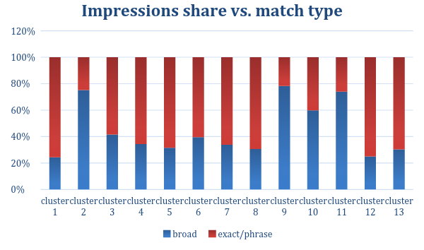
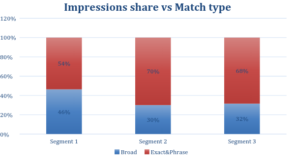
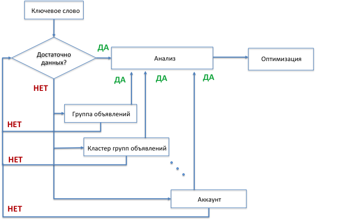
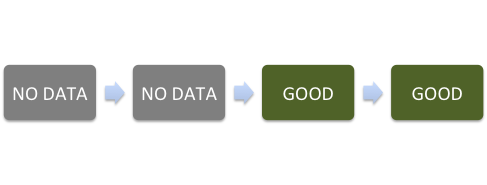
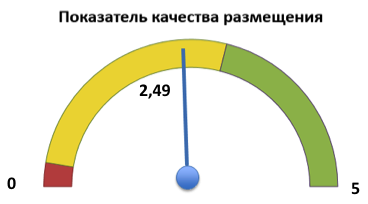
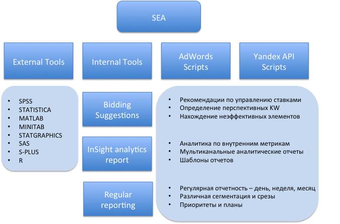

# Эффективные подходы к анализу контекстного размещения.
### Не тратьте время на догадки.

##### Авторы:
##### Сергей Волчков, Руководитель отдела рекламы на поисковых площадках, Lamoda
##### Елена Науменко, Старший менеджер по контекстной рекламе, Lamoda
##### [Обсуждение](http://on.fb.me/1raHJ0g) / [Презентация](http://slidesha.re/1raHJx4) / [видео](http://youtu.be/9aCVig5J-Yw)

http://youtu.be/9aCVig5J-Yw

### Больше данных, больше возможностей

С ростом рекламного рынка и конкуренции внутри сегментов, рекламодатели сталкиваются с увеличением количества обрабатываемой информации, усложнением структуры и, как следствие, методов анализа. С ростом знаний и возможностей, компании вводят новые метрики, позволяющие более точно отразить бизнес-задачи компании и рекламного размещения. В связи с данными тенденциями возрастает количество вопросов, требующих точных и своевременных ответов, дающих понимание, оценку текущего состояния рекламного размещения и позволяющих принимать правильные, взвешенные решения. Для решения этих вопросов вводятся процессы исследования и анализа отдельных элементов структуры.

Прежде чем приступить к анализу, необходимо создать последовательность процессов, отражающую основные этапы. Данный подход позволит заранее спланировать порядок работы, поставить задачи, определить промежуточные цели и применить полученные результаты.

Процесс исследования является, пожалуй, одним из основных двигателей по улучшению эффективности рекламных размещений. На данном этапе выдвинутые ранее теории и предположения подвергаются рассмотрению и оцениваются на практике. В данном случае рассматривается распределение показов, кликов и дохода по общему объему ключевых слов. Этот анализ позволяет выявить истинное распределение трафика, получить данные о количестве высоко-, средне-, низкочастотных ключевых слов. Понять, распределение дохода и в итоге сосредоточить основные усилия по оптимизации на главных сегментах. Какие же сегменты являются основными? Высокочастотные ключевые слова, генерирующие огромную долю трафика и дохода? Среднечастотные – не менее дорогие, но менее объемные? Низкочастотные – в зависимости от размещения генерирующие основной объем кликов и очень дешевые конверсии? Так как же оценить весь объем ключевых слов и не упустить ничего важного? Ответом на данные вопросы являются два подхода:

1. Поиск данных на различных уровнях агрегации, а если уровней нет в стандартной структуре, то их создание с помощью сегментации и кластеризации;

2. Введение дополнительных метрик и/или промежуточных целей.

Рассмотрим первый пункт. Сегментация представляет собой метод для нахождения частей и определения объектов, на которые стоит направить основную маркетинговую деятельность.

Сегментация – основа для выбора правильного сочетания элементов комплекса маркетинга, она проводится с целью максимального удовлетворения запросов покупателей (CTR, CR), а также рационализации затрат (CPO, CRR, CLV).

Таким образом, мы выделяем наиболее важные сегменты данных, на уровне которых возможно получить дополнительную информацию и учесть её при дальнейшем анализе.

Критериями для сегментов являются:

* Емкость сегмента (сколько товаров (услуг), какой стоимостью может быть продано на данном сегменте);

* Достаточность сегмента (достаточно ли данных для оценки эффективности сегмента);

* Стабильность сегмента  (как изменяется в течение сезона/периода размещения)

* Эффективность сегмента;

* Важность/Влиятельность сегмента (влияние на эффективность размещения).

Сегментация позволяет взглянуть на данные с различных срезов, а визуализация – проанализировать.

В качестве примера можно привести следующие виды сегментаций:

* Распределение показов по количеству ключевых слов;

* Распределение кликов по количеству ключевых слов;

* Распределение заказов/дохода по количеству ключевых слов;

-   Распределение CRR (CIR) по высокочастотным, среднечастотным, низкочастотным запросам;

* Распределение количества ключевых слов по типу соответствия;

* Распределение по показателю эффективности.

### Правильная структура - доступ к данным

Для получения достоверных данных по сегментам, необходимо построить правильную структуру кампаний и обратить внимание на следующие пункты:

1. Структура должна быть максимально дискретной, иметь четкие правила именования и разделять типы трафика;

2. Трафик должен распределяться максимально корректно:

* трафик должен верно распределяться между типами соответствий;

* трафик должен верно распределяться между long tail и generic ключевыми словами.

Иначе это может стать причиной ошибочного суждения и привести к неверному решению.

Ниже приведем пример, как можно проверить корректность распределения трафика между типами соответствия:

Высокий процент показа объявлений по точному и фразовому типу соответствия свидетельствует о:

* Достаточном количестве структур в точном и фразовом соответствии;

* Корректном распределении траффика;

Зависит от:

* Целей размещения – собрать поисковые запросы и уточнить семантическое ядро;

* Этапа размещения – обычно большое число широкого соответствия используют на начальном этапе работы кампаний.

Данный вид анализа возможно применять при регулярной работе с размещением, для проверки достаточности структуры и распределении трафика. На диаграмме, представленной ниже, видно, что сегменты кампаний 2 и 3 имеют достаточно хорошее распределение показов 70% к 30%, а сегмент 1, можно дополнительно проверить. Сравнивать можно либо со средним распределением по кампаниям, либо по рыночным показателям.

При корректной структуре с каждого уровня агрегации данных можно получить всю необходимую информацию. В случае стандартной структуры контекстного размещения мы имеем три уровня:

1. Уровень кампаний;

2. Уровень групп объявлений;

3. Уровень объявлений и ключевых слов.

Каждый из уровней характеризуется определенным набором данных, которые можно оценить как в качественном, так и в количественном отношении. Наиболее дискретные и точные данные присутствуют на уровне ключевых слов, но зачастую их не достаточно для принятия решения, поэтому переходим к вышележащему уровню – группам объявлений. На уровне группы объявления – данные по эффективности нескольких ключевых слов, групп товаров или модификаторов. Если и тут нет данных, то переходим к уровню кампаний. На уровне кампании – данные по эффективности типов товаров и услуг. Отдельно оцениваются объявления, на их уровне присутствуют данные по эффективности креативов для определенных пользовательских запросов. В качестве промежуточных уровней для получения дополнительной информации можно включать:

* Уровень кластеров групп объявлений;

* Уровень кластеров кампаний.

Данные, полученные с этих уровней, должны использоваться в качестве дополнительной информации для анализа, оценки и принятия решения. При этом всегда следует помнить, что наиболее значимые данные будут присутствовать на самом дискретном уровне.

### Оценка эффективности размещения

Так как все же оценить, достаточно ли данных для анализа или нет на самом дискретном уровне?

Например, можно использовать следующий подход:

Для размещения ориентированного на объем трафика, это:

Количество показов для одного клика Impressions/Clicks

Для размещения, ориентированного на целевое действие, это:

Количество кликов/сессий для одного целевого действия Clicks or Sessions/Actions

Далее происходит сравнение рассчитанной величины с кликами определенного объекта, ключевого слова, группы объявления, кластера и делается вывод.

Более подробно данный процесс отображен на диаграмме процессов:

 Каждый уровень агрегации данных просматривается последовательно, в случае, если данных достаточно на самом дискретном уровне, процесс просмотра останавливается и данные передаются в блок анализа, а затем в оптимизацию. Если же данных недостаточно, то используется более высокий уровень, с большей степенью агрегации. При рассмотрении ситуации с наличием данных на различных уровнях и оценкой размещения, приходится проводить анализ данных об эффективности на уровне ключевых слов, групп объявлений, кампаний, кластеров групп объявлений. Результатом данного анализа является цепочка оценок каждого элемента, например, последовательность:

No data – No data – Great – Great – позволяет понять, что данное ключевое слово работает эффективно и/или имеет потенциал. Как рекомендуемое действие может быть представлен следующий вариант: повысить ставку, если средняя позиция выше 1.4, и попробовать собрать дополнительный трафик. На следующем раунде анализа проверить изменение эффективности.

### Универсальная метрика или на чем остановить выбор?

Другой возможный подход к анализу текущих размещений, это создание универсальной оценочной метрики, которая бы отвечала бизнес-целям кампании, поскольку цели могут быть комплексными, т.е. учитывать не одну метрику, а несколько различных показателей.

Данная оценка проводится на уровне кампаний. Для её создания необходимо пройти следующие шаги:

1. Оценивается необходимое количество данных на уровне кампаний (полнота данных)

2. Кампании сегментируются по количественному показателю (важность данных)

3. Индивидуальный анализ каждой группы кампаний
*В качестве входных данных можно взять основные метрики и их производные, и уменьшить их количество в процессе анализа, выделив основные группы.*

4. С помощью метода k-средних кампании кластеризуются внутри сегментов (на четыре кластера, как в примере).

5. Рассчитывается средняя компонента для каждого кластера.

6. Финальным этапом анализа будет расчет нормированной оценки

На основе нормированной оценки происходит расчет показателя качества размещения:

Для реализации данного подхода требуется применить комплексные методы расчетов и специальные функции. Как же обработать большой объем данных и произвести множество вычислений?

Самый простой способ - обрабатывать вручную или с помощью **микрокалькулятора**. Так и поступали до наступления эпохи компьютеров. Способ посложнее - воспользоваться программами общего назначения, например, Excel. Однако реализация статистических функций в таких пакетах оставляет желать лучшего. **Самый сложный способ** - научиться пользоваться специализированными статистическими программами.

Таковых существует два вида:

1. программы с интерфейсом меню и кнопок (**SPSS, STATISTICA, MiniTab, StatGraphics**)

2. программы, общающиеся с пользователем в режиме команд (**SAS, S-PLUS и R**).

###  Основные инструменты SEA

Подводя итог, рассмотрим инструментарий, необходимый для эффективной работы и анализа контекстного размещения:

Базу инструментов составляют четыре элемента:

1. Скрипты для работы с Яндекс.Директ API

2. Скрипты для работы c Google AdWords API и AdWords Scripts

3. Инструменты внутренней разработки:

 * Модуль рекомендаций

 * Модуль внутренней аналитики

 * Модуль регулярных отчетов

4. Внешние инструменты:

 * SPSS

 * STATISTICS

 * R

 * SAS

 * ADLENS

 * KENSHOO

 * MARIN

 * MATLAB

Данные инструменты не являются критически важными для любого контекстного размещения, но позволяют оптимизировать многие аналитические задачи, в том числе те, которые были рассмотрены в данной статье.

##### [Обсуждение](http://on.fb.me/1raHJ0g) / [Презентация](http://slidesha.re/1raHJx4) #####

